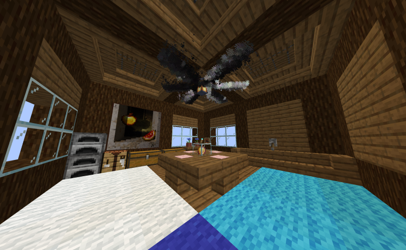
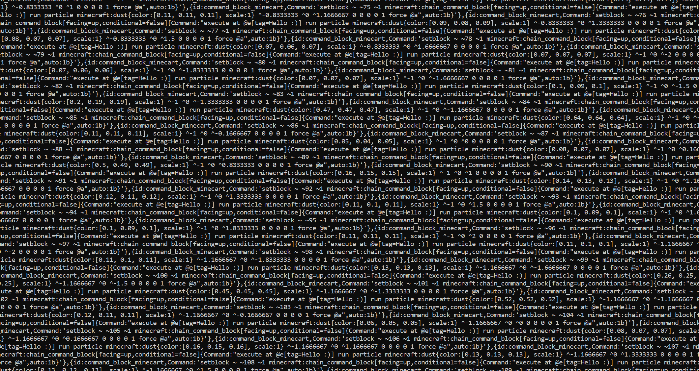

# Minecraft Datapack To Commands

A project that aims to make the export from **[Particle converter](https://github.com/kemo14331/Particle-Converter/tree/main)** .mcfunction files and turn them into command block creations to use datapacks in completley vanilla

# Warnings

**Very** Laggy

Made for Minecraft 1.21 should work for some older versions but idk

Can **seriously** hurt mspt and tps

# How to use:

In the directory type `pip install -r requirements.txt`

Use **[Particle converter](https://github.com/kemo14331/Particle-Converter/tree/main)** and set the mode to Relative Local then configure everything

Next open the exported .mcfunction and copy its contents to commands.txt Empty lines and line with # will be ignored

Using the terminal run `py main.py`

Set the mode r or i 

R = Repeating

I = Impulse

Repeating means when activated it will repeat every tick
Impulse makes it happen once

The commands are split into 32,000 chunks of charcters due to command blocks charter limit, you can disable this in settings.

Next run `py copy.py`
It will automaticly copy every command 1 by one into your clipboard, press p to go to the next command

Pase each command into a command block and activate it

Spawn a armor stand and add a tag to it (Can be anything like player, mobs, ect (Armor stand is a example but reccomened for most effects that are static)) that is the same as what you entered in on main.py

Hook up all of the command blocks together and power them

